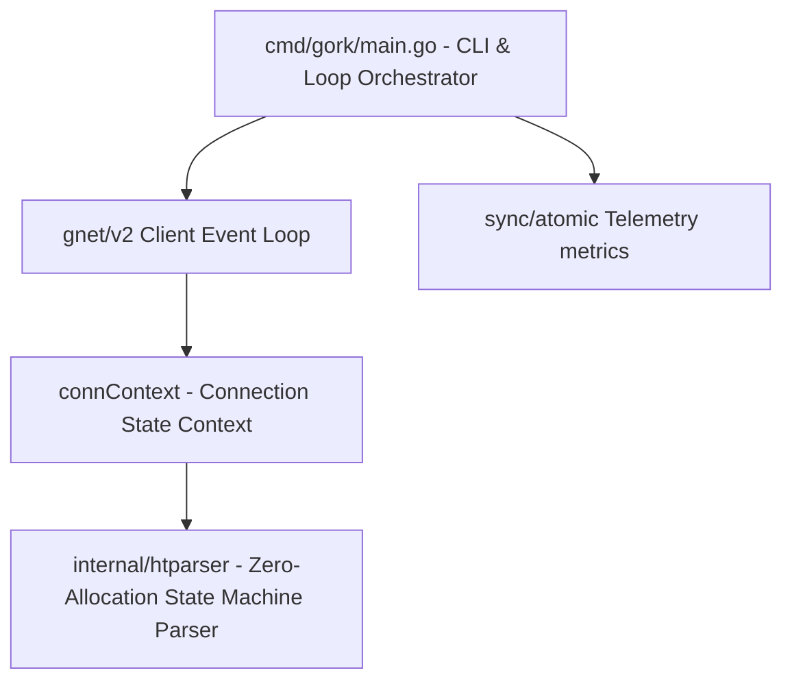

# Source of Truth - Gork

This document serves as the absolute single source of truth describing the Gork high-performance asynchronous HTTP benchmarking tool.

---

## 1. System Overview

Gork is an asynchronous, event-driven HTTP benchmarking tool designed for maximum throughput and sub-millisecond latency precision. It maintains a pool of concurrent connections to pipeline HTTP/1.x requests over non-blocking TCP streams, collecting lock-free telemetry.

---

## 2. Core Components

### A. Loop Orchestrator (`cmd/gork/main.go`)
* **Role**: Configures environment, parses flags (`-url`, `-c`, `-n`, `-d`), and initializes the event-driven client.
* **Bootstrap**: Vectorizes static HTTP request bytes once to avoid CPU interpolation overhead in hot loops.
* **Event Handling**: Manages the `gnet.EventHandler` implementation `httpClient`:
  * `OnOpen`: Allocates `connContext` and writes initial request.
  * `OnTraffic`: Appends incoming bytes to `connContext.buf`, routes header parsing to `htparser.Parser`, manages chunked/length body completeness checks, updates latency metrics, and immediately triggers `AsyncWrite` for the next request.
  * `OnClose`: Asynchronously dials new sockets to maintain the concurrency target (`-c`) when connections terminate.

### B. Stateful Connection Context (`connContext` in `cmd/gork/main.go`)
* Holds connection-specific variables:
  * `parser *htparser.Parser`: Dedicated response parser recycled via `Reset()`.
  * `buf []byte`: Dynamic, persistent slice accumulating incoming TCP frames.
  * `requestStart time.Time`: Captures VDSO-based system time at request write.
  * `headerParsed bool`: Tracks if the response start-line and headers have already been parsed, skipping redundant parser execution on subsequent TCP frames of the same response.
  * `bodyOffset int`: Position inside `buf` where the response body starts.

### C. Joyent C-Based Parser (`internal/htparser` Package)
* **Location**: `internal/htparser/htparser.go`
* **Role**: Custom state-machine HTTP response parser translated from Joyent C `http_parser` 2.7.1.
* **Memory Conservation**: Uses `github.com/valyala/bytebufferpool` to copy and slice tokens (version, status, reason, headers), preventing garbage collection (GC) allocations.
* **HTTP/1.0 Compliance**: Evaluates version and connection headers. Sets `ConnectionClose = true` for `HTTP/1.0` responses lacking explicit `Connection: keep-alive` declarations, signaling Gork to terminate and cycle the socket.

---

## 3. High-Performance Telemetry

* **Atomics**: Updates all success/fail counters, total read/written bytes, and latency bounds lock-free using `sync/atomic` operations.
* **Linear Latency Histogram**: Maps durational latencies directly into 2000 linear buckets of 100 microseconds (0 to 200ms range) and an overflow bucket. This constant-space $O(1)$ structure calculates P50, P90, P99, and mean latency without heap allocation.
