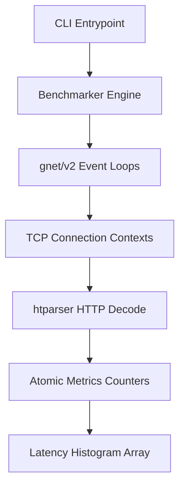

# Technical Architecture - gork

This document outlines the software components and data structures driving `gork`.

## Core System Diagram

- **Benchmarker Engine:** Coordinates runtime durations, dials target hosts, and spawns the `gnet` event loops.
- **gnet/v2 Event Loops:** Pinned OS thread loops multiplexing incoming TCP socket buffers without context-switch overhead.
- **TCP Connection Contexts:** Recycle buffer segments and carry state tracking for fragmented packets.
- **htparser HTTP Decode:** A C-derived state machine translating incoming bytes into status codes and headers in a zero-heap-allocation loop.
- **Latency Histogram Array:** 2000 linear integer bins of 100 microseconds tracking latency counts from 0 to 200 milliseconds.
